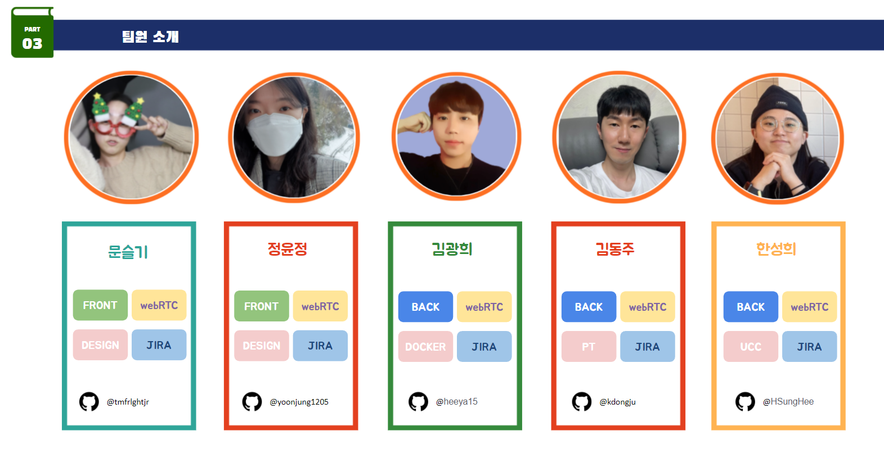
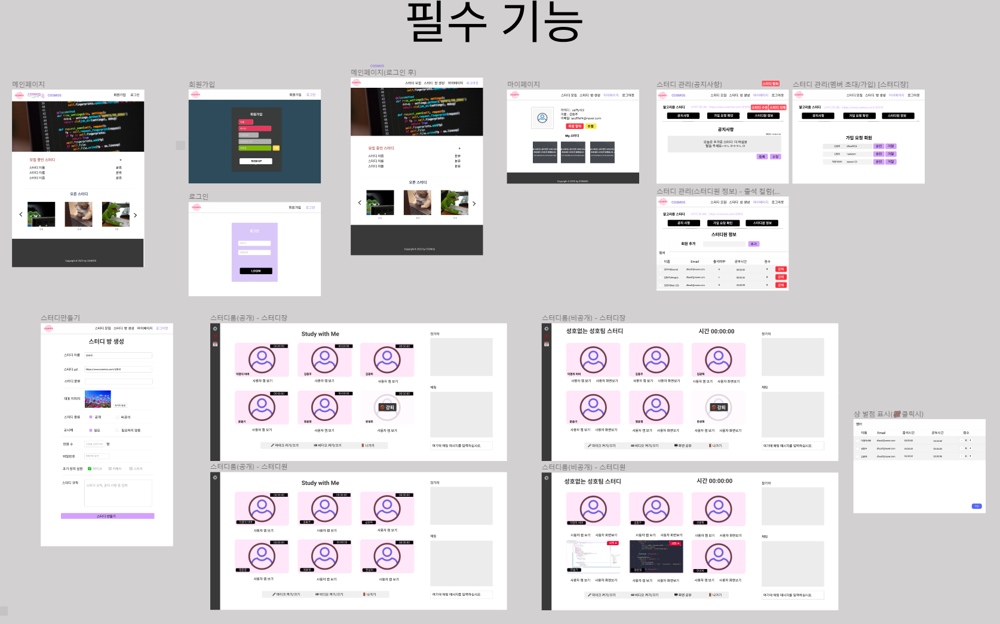
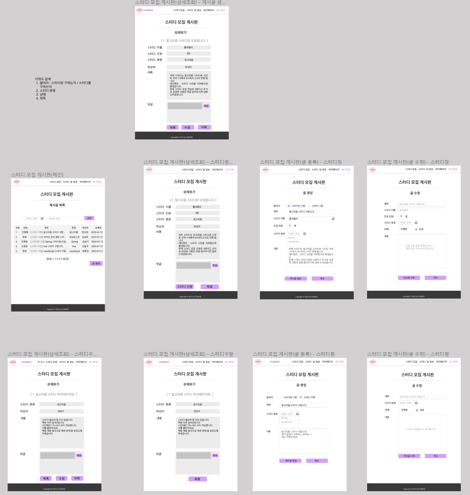
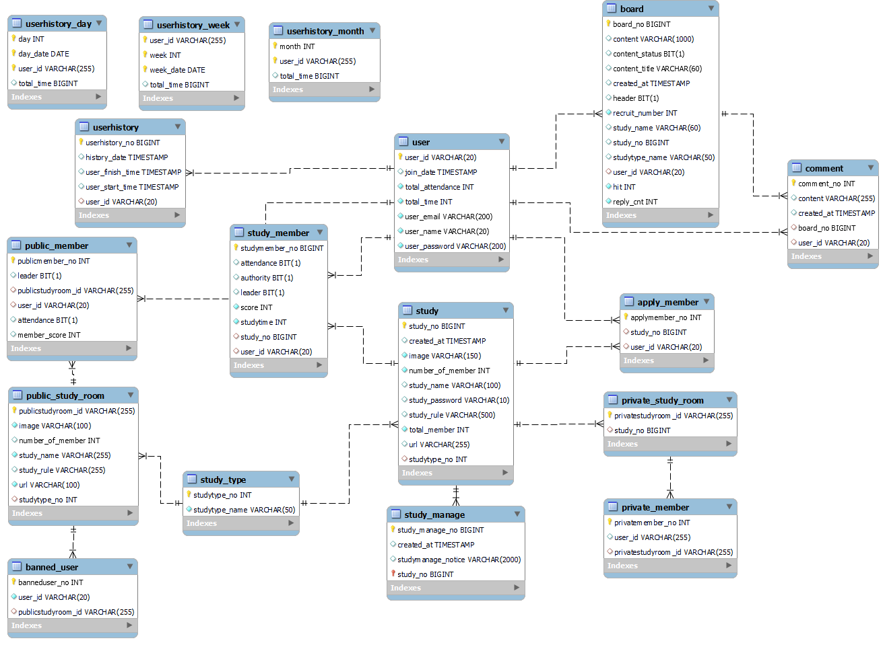
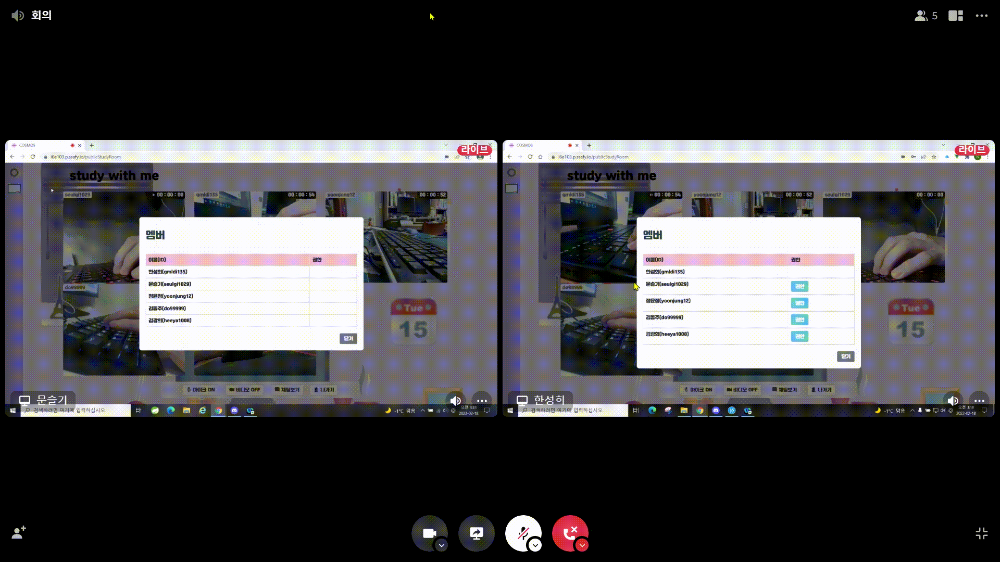
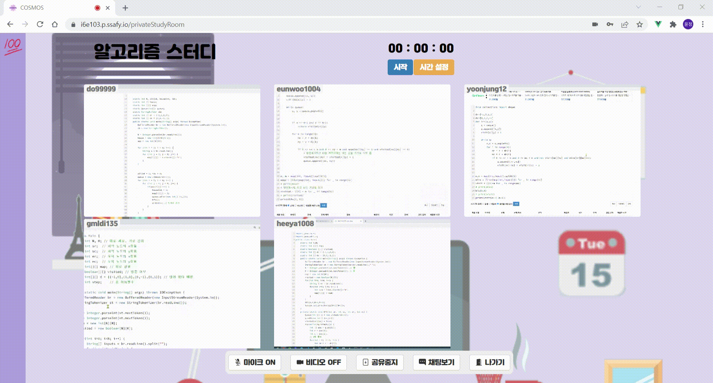

# 🌸 COSMOS(코스모스-코딩 스터디, 모두 함께 스터디)

비대면 화상 IT 스터디 플랫폼


## 👪 팀원 소개


##  🕹Git 컨벤션 개요

Conflict를 방지하고, 효과적이고 명확한 협업을 진행하고자

1️⃣ **Git-Flow** 브랜치 전략을 도입하여 계층별 브랜치를 관리했습니다

2️⃣ [AngularJS Commit Conventions](https://gist.github.com/stephenparish/9941e89d80e2bc58a153)를 참고하여 **Commit 컨벤션**을 정의했습니다

3️⃣ 작업의 시작 전 JIRA 티켓을 생성하고, 모든 커밋과 티켓을 연결했습니다

위와 같은 세 가지 협업 규칙을 세우고 프로젝트를 진행했습니다.


## 🏞 Git Flow

```
master   
└ develop  
  ├ front - feature/front/기능...  
  └ back - feature/back/기능...
  
```

- master : 운영 서버로 배포하기 위한 브랜치
- develop : 다음 출시 기능을 개발하는 브랜치
- front : 프론트엔드 개발하는 브랜치
- back : 백엔드를 개발하는 브랜치
- feature : 세부 기능을 개발하는 브랜치


## 😎 Commit Convention

> [type] commit message

- Type

  - **Fix** : 잘못된 동작을 고칠 때

    > fix function/error/typo in style.css

  - option

    - funtion : 고친 함수 명 (e.g. fix login function in index.html)
    - error : 수정한 에러 (e.g. fix [구체적 에러명] error in login.js)
    - typo : 오타 (e.g. fix typo in style.css)

  - **add** : 새로운 것을 추가할 때

    > add mytest.test for test (새로운 파일 추가 시)

    > add blue color to style.css (기존 파일에 내용 추가 시)

  - **move** : 코드나 파일을 이동할 때

    > move A to B (e.g. A를 B로 이동할 때)

  - **rename** : 이름 변경이 있을 때

    > rename A to B (e.g. A를 B로 이름을 변경할 때)

  - **update** : 정상적으로 동작하는 파일을 보완하는 경우

    > update test.js to use HTTPS (test.js에 기존의 프로토콜에서 HTTPS 프로토콜 사용으로 변경)

  - **remove** : 삭제가 있을 때

    > remove test.js (파일 삭제 시)

    > remove black color from style.css (파일 내 부분 삭제 시)

- commit message: 변경 사항에 대해 명확하게 기술


## 🖥 프로젝트 개요

</img></img></img></img> </img></img>


- **진행 기간** : 2022.01.10 ~ 2022.02.18

- **목표**
  
  - webRTC 기술을 사용해 비대면 화상 IT 스터디 플랫폼을 만듭니다.
  - 스터디 모집과 스터디 활동을 모두 지원하는 스터디 플랫폼을 목표로 합니다.
  - 서비스를 이용하는 사람들로 하여금 공부에 대한 자극을 주는 서비스를 제공합니다.
  
  

- **🗺와이어프레임**(figma)

  

  


- ERD

  


## 🐱‍💻 프로젝트 소개

### 기획배경

- 높아진 IT에대한 관심

- 독서실의 가격 상승
- 코로나19 심화로 카페, 동아리방 등 공부하기가 걱정되는 환경
- 요리조리 왔다갔다 여러가지 플랫폼 사용으로 번거로운 스터디 활동


## 📌주요 기능

### 🔑공개 스터디

> study with me 와 같은 오픈된 캠스터디

- 권한(권한이 있는 사람은 강퇴할 수 있음)

  - 권한 부여 기능

  

  

  - 강퇴 기능

  

  

- 스톱 워치

- 마이크,카메라 & 채팅


### 🔒비공개 스터디

> 같은 목표를 가진 소수의 사람들로 구성된 스터디

- 타이머(모든 사람이 같은 타이머를 보고 )

  

  

- 화면공유

  

  

- 상벌점 기능

  


## 🛠 프로젝트 빌드

- Frontend/Backend

  [프론트엔드/백엔드](./exec/프로젝트_빌드_및_배포_문서.md)


## ⚙ 시스템 환경 및 구성

- OS: Windows10
- Backend Framework: Spring Boot 2.4.5
- Frontend Framework: Vue 2
- DB: mysql  Ver 8.0.27 for Win64 on x86_64 (MySQL Community Server - GPL)
- WAS: Gradle
- JVM: openJDK (1.8.0_192)
- Node.js: 16.13.1
- WebRTC: openVidu 2.20.0
- Docker: 20.10.12
- WEB: Nginx (1.18.0)


## 📑 프로젝트 후기

- 문슬기 : 프로젝트 시작할 때 깃 사용법이 어려웠는데 브랜치 사용하는데 익숙해 졌고, 지라와 도커 그리고 my sql을 이번에 사용하는 방법을 팀원들이 알려줘서 배울 수 있었습니다. ACE 팀에 참여해서 프로젝트를 진행하는데 걱정이 없었고 좋은 팀원들을 만나서 제대로 된 첫 프로젝트를 할 수 있었습니다. 이번에 정말 많이 배울 수 있는 시간을 가져서 좋았습니다! 😘😘


- 정윤정 : webRTC 라는 분야가 너무 생소해서 과연 이 프로젝트를 잘 해낼 수 있을까 걱정이 앞섰었습니다. 하지만 좋은 팀원들 덕분에 무사히 유종의 미를 거둘 수 있었습니다. 처음 다뤄보는 깃과 지라는 낯설었지만 점점 적응해 지난 프로젝트보다 잘 활용하게 되었습니다. 혼자가 아니라 다같이, 또 한 사람도 빠지는 사람없이  새벽까지 모여서 코드를 쳤던 것이 기억에 남습니다. 이렇게 다같이 해서 우리 프로젝트 무사히 끝냈습니다!!🥰


- 한성희 : 이번 프로젝트를 통해 Git, Jira와 같은 협업툴을 이용하여 함께 하나의 산출물을 만들어내는 과정에 익숙해질 수 있는 시간이였습니다. JPA, Vue.js, Docker 등 처음 사용하거나 익숙하지 않은 기술들을 학습하고 직접 프로젝트에 적용해봄으로써 기술들을 익혀나갈 수 있었습니다. ✍ 나의 작업만이 아닌 팀원 모두의 코드를 리뷰하고 오류나 모르는 부분을 함께 해결해나가면서 놓친 부분을 찾고 서로를 통해 배울 수 있는 좋은 기회였습니다. 👍 더 퀄리티 높은 시스템을 제작하기 위해 끝까지 지치지않고 힘써준 팀원들에게 감사하고😊 다음 프로젝트는 함께하지 못했지만 기회가 된다면 마지막 자율 프로젝트에서 만나서 우리의 코스모스 시스템을 보완하고 추가기능들을 모두 구현했으면 좋겠습니다. 🙏


- 김광희 : 다들 6인 프로젝트... 하지만 우리 팀은 5명이서 모두 잘해줬기에 프로젝트를 성공적으로 마칠 수 있었습니다.  이번 계기로 팀워크와 협업의 중요성에 대해 많은걸 느꼈고, 각자의 장점이 모여 서로의 부족한 점을 보완할 수 있으며 팀원들과 함께라면 어떠한 것도 해낼 수 있을거 같다는 자신감이 있었습니다. 이번 공통 프로젝트를 통해 처음하는 Docker 및 JPA 등 많이 배우며 성장했고, 깃 Flow, Jira를 사용하여 비대면 상황이더라도 효율적으로 소통하고 협업하는 법을 익힐 수 있었습니다.  체력적(잠을 못 잠)으로 정신적으로(왜 안되지?) 많이 힘들었지만, 팀원들과 소통하며 문제를 잘 해결해 나아갔고, 저 스스로 정말 열정적으로 프로젝트에 임했다고 자부할 수 있습니다. 마지막으로 우리 팀원들 모두 수고했고 코스모스팀 화이팅!!😀


- 김동주 : 이번 프로젝트로 잘 다루지 못했던 깃, 지라 등 협업툴에 대해 익숙해질 수 있었고, 프로젝트의 기획, 설계 단계부터 꼼꼼히 배울 수 있었습니다. 좋은 팀원들과 함께여서 더 잘 배우고 더 많이 배울 수 있었던 것 같고, 개발 역량이 늘어난 것뿐만아니라 좋은 사람들을 남길 수 있었던 프로젝트여서 더 행복했습니다. 앞으로 모든 팀원들 다 잘 돼서 다시 만났으면 좋겠습니다. 성호없는성호팀 화이팅! 🌸🌸


## 🎞 최종산출물

[시연영상](./exec/공통PJT_부울경_1반_E103_시연영상.mp4)

